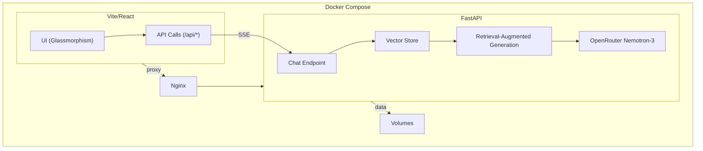

# Architecture

```mermaid
flowchart TD
    subgraph Frontend[Vite/React]
        UI["UI (Glassmorphism)"] --> API["API Calls (/api/*)"]
    end
    subgraph Backend[FastAPI]
        API -->|SSE| Chat["Chat Endpoint"]
        Chat --> Vector["Vector Store"]
        Vector --> RAG["Retrieval‑Augmented Generation"]
        RAG --> Model["OpenRouter Nemotron‑3"]
    end
    subgraph Docker[Docker Compose]
        Frontend -->|proxy| Nginx[Nginx]
        Nginx --> Backend
        Backend -->|data| Volumes[Volumes]
    end
```

The diagram visualises the interaction between the UI, Nginx reverse‑proxy, FastAPI backend, vector store, and the remote LLM.
